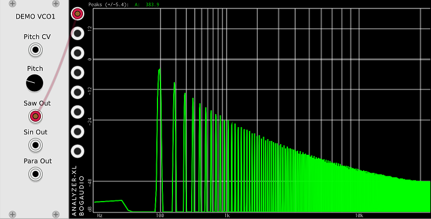
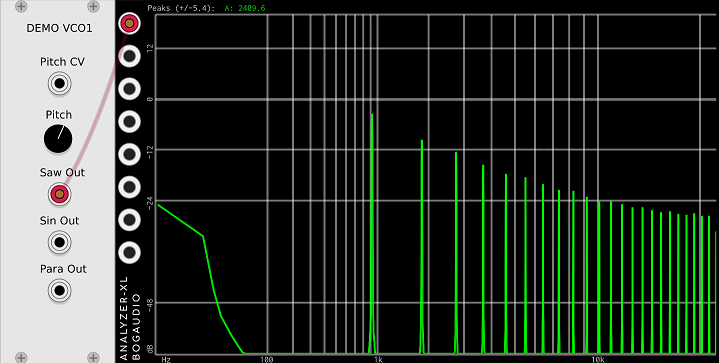
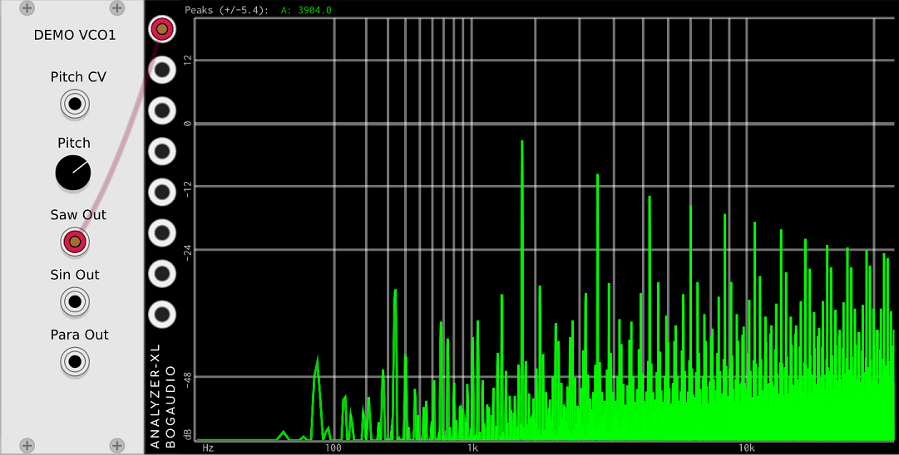

# More on aliasing

In the last section we saw that our Demo VCO1 aliases a lot. But there are some subtleties to measuring aliasing. It's important to have some understanding of this if you intend to measure a plugin you're writing, or even if you want to evaluate a plugin to decide if it's worth investing your time in.

Now, we already know that Demo VC1 has a lot of aliasing. But below is a screen shot of another plot from Demo VCO1, and it doesn't look so bad. What's up here?

The difference here is the we are analyzing a low frequency tone. There are several things that make it difficult to see aliasing at these low frequencies:

* Since the harmonics fall off at 6 dB per octave, the level will be fairly low by the time the harmonics are at `Fs/2`, so when they fold back and alias it will be at a lower level. So - low frequency tones will not alias nearly as much as high frequency tones.
* By the time the plot gets to the upper frequencies, there are so many harmonics bunched together that it's difficult to see what is going on. (Dear Bogaudio. Please add a zoom feature, or some other way to look at the high frequencies).

Now, below is another plot from Demo VCO1. This time it is not at a low frequency, but there does not seem to be any aliasing. What's going on here?

This is a special case. Here we carefully tuned the frequency of Demo VCO1's sawtooth waveform to be an exact division of the sampling rate. That puts all the alias frequencies at harmonic frequencies. So it is difficult to see or hear them. If you look very carefully you can see that up around 10 kHz the harmonics stop falling off at 6 dB per octave. That's because the aliasing is adding energy at those frequencies.

So, to avoid getting a "false negative" when testing the quality of your own VCOs, make sure to:

* Use a relatively high frequency. Around 1 kHz is pretty good.
* Adjust the pitch back and forth a little bit to get the most visible aliasing.

If a VCO with sharp waveforms like saw and square has no alias mitigation code, it will almost always have the unmistakable effect in the high frequencies where it clearly folds back from `Fs/2`, and the level of the highest alias tones is about the same as the level of the real harmonics.

Below is Demo VCO1 again. This time adjusted as we describe to show the bad aliasing.

Next we will make [a new VCO (Demo VCO2) to fix these issues](./vco2.md).
