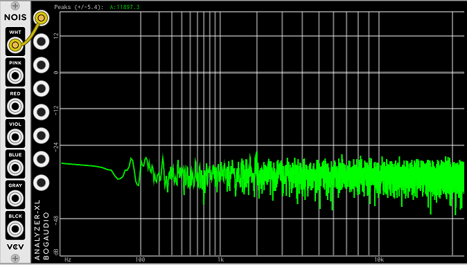
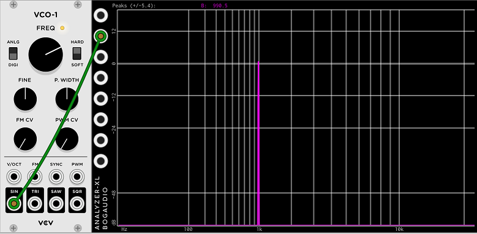
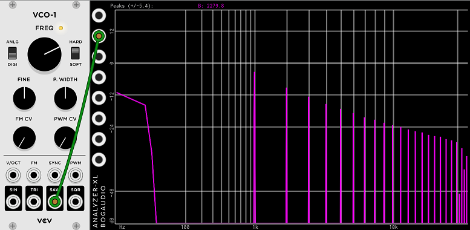

# Using a frequency analyzer

This may be fairly basic, so feel free to skip ahead.

A frequency analyzer is quite often the best way to visually examine your audio. It will tell you the volume of the audio at specific frequencies. Often this provides insights that that would be impossible to discern by looking at the waveform on a scope.

The Bogaudio Analyzer XL is a very nice implementation, so we will use that here.

An analyzer will draw you a real time graph, where the x axis is frequency, and the y axis is amount, or volume.

Here is what white noise looks like:

Notice that, while it is a little jagged, the height of the graph is more or less the same at all frequencies. That is what white noise should look like.

For contrast, here is what a sine wave looks like:

Here, as expected, the analyzer displays no level at all at most frequencies, and a nice sharp line near 1kHz.

A periodic waveform that isn't a sine will also have level at some of its harmonics. A square wave will only have "odd" harmonics, whereas a sawtooth will have all harmonics. For both of them the harmonics extend all the way to infinity, although the level falls off at 6db per octave.

A sawtooth at about 1kHz from Fundamental VCO-1 look like this:

Here we see mostly what we should see. The largest line at very close to 1khz. It's the fundamental. And we can see that there are harmonics at 2k, 3k, 4k, etc... Looking at the display, we can see that the level of the harmonics falls about 6db every octave.

There are some very minor anomalies, too. All the was on the left there is a "hump". This tells us there is a small amount of DC at the output.

Also we can see that above 10kHz the harmonics fall off a little faster, and there are some strange signals that are not harmonics in between 10k and 20k. But this "junk" is more than 30 decibels below the fundamental, at at a very high frequency where we can't hear so well. This distortion (actually aliasing) is probably well below the level of audibility.