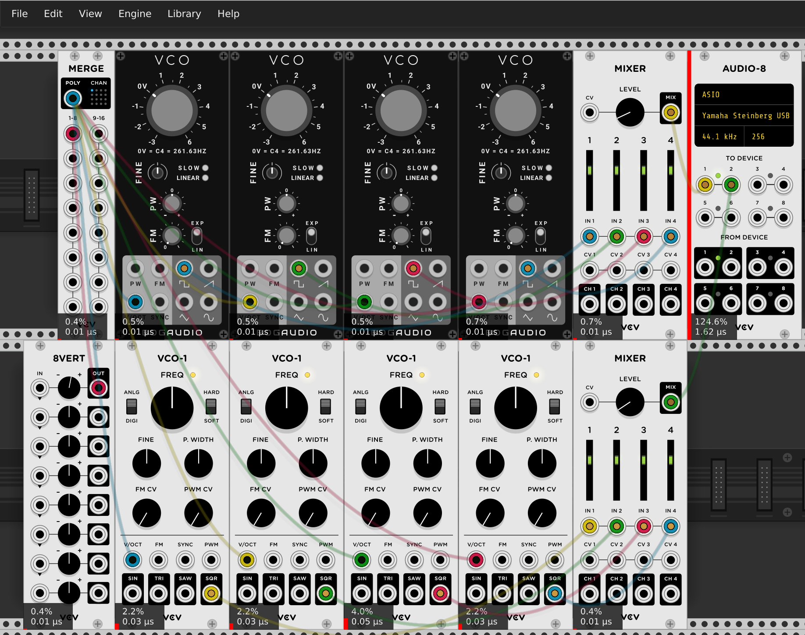
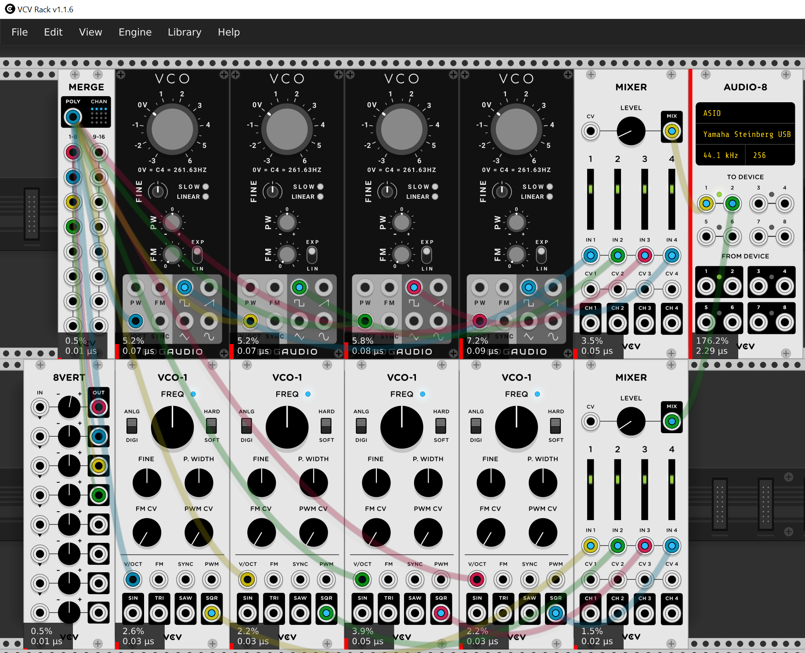
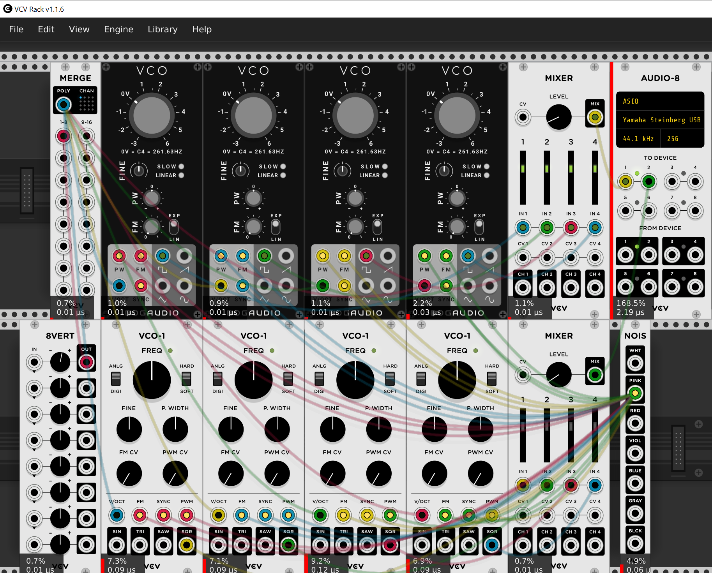

# Using VCV CPU meters

This document began as a forum post on the VCV Community forum. But it was pretty popular, so I'm putting a copy here.

I’m going to show how I compare/test two plugins. I’m sure others have their own way, I’m sure there are plenty of good ways.

First of all, I arbitrarily picked two VCOs, One from Bogaudio, one from VCV. I could have picked other ones, but I picked these ones because the are reasonably comparable, I know they are both very good, and I have used them a lot.

I set VCV for one thread, real-time priority. I tested three “patches” monophonic with no modulation, 4 voice polyphony and no modulation, and then monophonic with lost of modulation. This will tend to hit the performance areas I’m interested in, a) how does the cpu usage change with polyphony, and b) does performance get terrible with lots of modulation.

With simple, well-designed modules like these, the number are too small to compare, so if the CPU usage is really low I set the engine sample rate to X 16, which is what I did here. This will usually make the CPU use increase by that much and make the numbers easier to read.

I use more than one instance to the module, as I can average them to get a more accurate read. Also it’s easy to see if the meters a giving an inaccurate reading on one. Usually I’m not trying to get a super accurate reading, so I can tell by looking how they compare. Sometimes I’ll just ignore the highest reading from both A and B.

Here are my results with one voice and no modulation:

Remember, these are very small numbers, and I had to artificially boost them 16X just to see them. Looking at these results my takeaway is that the CPU usage of both is very low. I’m sure one could easily find comparable modules that are much, much higher. Also, if it’s really a competition, the Bogaudio looks like it is 4X more efficient is this specific case.

Next up – same simple patch with four voice polyphony:

You can see here that the VCV VCO-1 CPU usage is unchanged by the switch to four voices. That’s because most of the VCV Fundamental modules use SIMD aggressively to get this result. Most of the Bogaudios do not use SIMD, IIRC. I don’t know why the Bogaudio seems to have gone up significantly more that X4. Perhaps it a flaw in the testing. None the less, they are both very good.

Lastly, the original monophonic test, with a lot of modulation patched. I patch a lot of modulation because often VCV users say that if they modulate everything the CPU usage shoots up. I used noise as a mod source because it’s sort of a worst case. Many modules save CPU by only updating when there is a change, so sending in a signal that is always changing will let us see if the performance is really going to get bad.

Here are the results:

In this test it looks like the Bogaudio CPU usage doubled with “lots of modulation”, and the VCV maybe tripled. These are pretty good results.
Conclusion: These tests are not the whole story, and certainly don’t test every aspect of the performance of these to excellent modules. But I think if you were looking at a new module this technique can easily determine if your new module is a “CPU hog”. The obligatory caveat – some modules do a lot, and need to use much more CPU than a simple VCO. That’s fine – you can spend your CPU budget any way you like. But at least running these tests will give you and idea of where the CPU is going. Also, if you have comparable modules you can always compare against each other. If they are almost the same, but one uses 10X more CPU, you might avoid that one.
