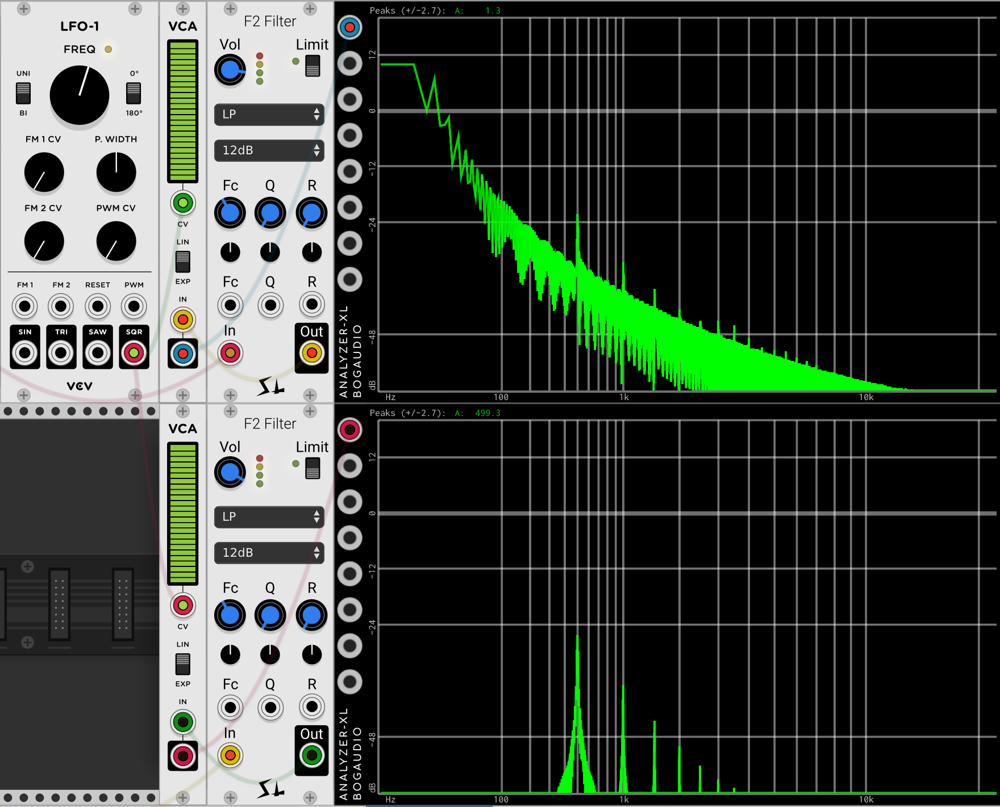
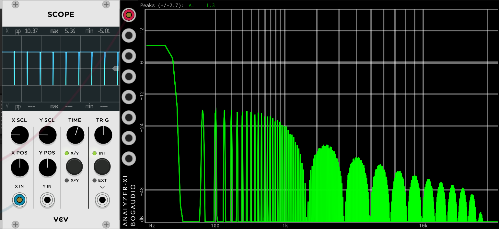
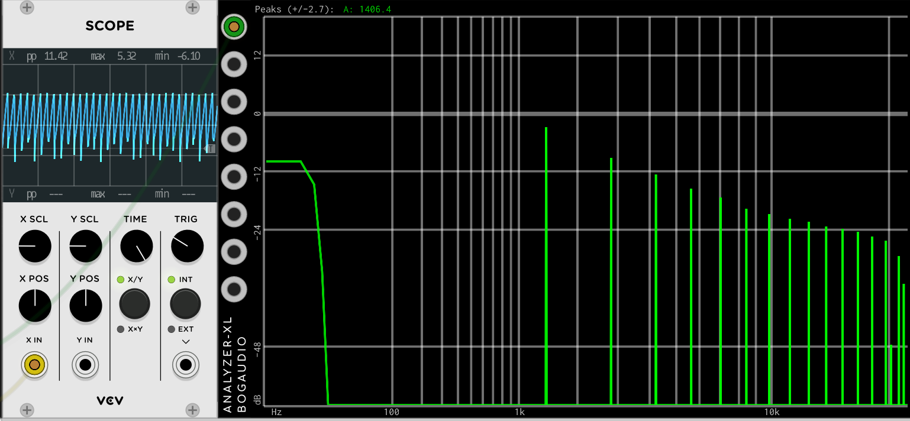
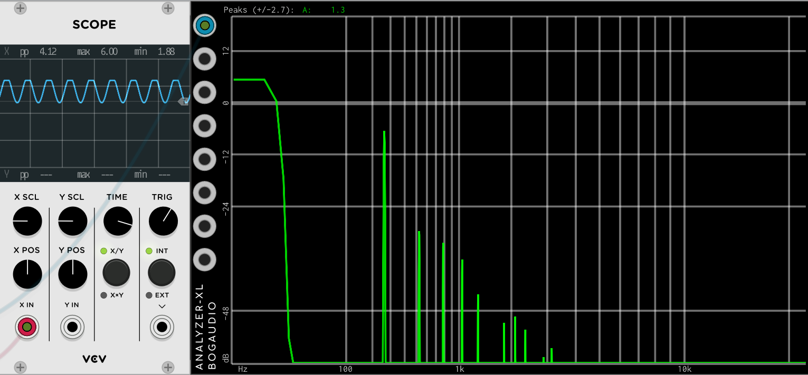

# DC Offset

## What is DC offset?

Audio signals are supposed to have energy at audible frequencies (roughly 20Hz to 20kHz), and none outside of it. Especially they aren’t supposed to have any energy at 0 Hz (DC). In analog electronics any DC is always removed at the output with basically a high pass filter.

## Why is it DC bad?

If a signal with DC is gated, it will produce a very loud audible thump as the inaudible DC it turned into a very audible “step”. This pop/thump will be very loud. So, if a VCO has a lot of DC on the output, running it through a VCA controlled by an ADSR will make some bad sounding junk.

Also, many non-linear signal processors like distortion, compression, etc. will process the DC along with the signal and work incorrectly.

Lastly, a large amount of DC on the output may drive the next processor into distortion, even thought the desired (AC) signal isn’t that high.

## Example

Here is a somewhat contrived example. There are two different VCOs here, one which has DC on the output, and one that doesn't. Next they go to low pass filters to remove some of the harmonics. They are set to the same frequency, and both set to narrow pulses. Then they to through VCA that are directly controlled by a single LFO. The LFO is at about 4 Hz.

You can see from the spectrum analyzers that the one on the bottom without the DC shows a fairly clean tone with a fundamental of 500 Hz. The one with DC shows the same 500hz tone, but it is pretty much drowned out by low frequency "garbage" that is basically what happens when you chop DC at 4 Hz.

You can try this patch yourself and see what it sounds like.

As we said, this patch is fairly contrived - the narrow pulses and the low pass filter aggregate the situation. More realistic patches will still sound bad with a lot of DC, but won't be quite this dramatic

## Where does DC come from?

There are several ways DC can get onto the output of a module.

### VCO Pulse waves

Many pulse-wave VCOs use a very simple algorithm to get their output. The put out 5 v when the output is high, and -5 when it is low. Just look at the scope of VCV and it’s clear that there is a LOT of DC on the output unless the pulse width is 50%.

Here is a commonly used, high quality VCO outputting a pulse with a very large width:

It's clear just from the scope that there is a ton of DC, and the signal spends most of its time at 5V, and rarely goes below that. And on the Analyzer it's more clear: the DC seems to be about 24 dB higher than any of the "good" harmonics.

### VCO Sawtooth waves

Many minBLEP sawtooth VCOs use the same minBLEP code. This code has a bug in it that introduces DC in the output. The amount of DC is pretty small at low frequencies, and is pretty high at high frequencies.

Here is a very popular minBLEP sawtooth in action:

You can sort of imagine there is DC there by looking at the scope, but the analyzer tells the real story. There is DC present, but it is 12db below the level of the fundamental. At higher frequencies there is more DC.

### Wave-shapers

Any non-linear wave-shaper is that can produce even harmonics is likely to generate DC, too. This is kind of obvious as the may many wave-shapers get even harmonics is by the “offset” control, which adds DC to the input to get these even harmonics (and also a lot of DC).

Here is a somewhat contrived patch where a sine-wave with no DC is run through a highly regarded wave-shaper with the bias (offset) control all the way up:

Here you can see on the analyzer that this is succeeding at generating even harmonic, but it's clear from both the scoped and the analyzer that there is a huge amount of DC on the output.

## How can your test your modules for DC?

It should be clear from the above text that it is easy to test for DC on the output of most modules. Just look at the output with an analyzer and it will usually be clear.

## As a user, how can you prevent destructive DC on the outputs?

An obvious way to avoid this is to test your modules, and only use modules that don't generate DC. For example, there are probably hundreds of VCOs that make pulses and saws. Pick one that doesn't output DC.

When you really want to use a particular module, and there isn't a clear alternative the works correctly, you can use high pass filters on the output to remove the DC. There are often called "DC Blockers". For example NYSTHI has a nice module that is 4 separate filers in one very narrow module.

## As a programmer, how can you avoid DC on the output?

It is very easy to avoid this problem.

For a pulse wave output, you can easily estimate how much DC will be on the output `(pulse width% - 50) / 10` in the case we just looked at. So estimate the DC and subtract it out. It takes much less CPU that a DC blocker. For an example, look at the source to our BasicVCO.

For a saw-tooth it's a little more difficult, as there is no trivial way to estimate the erroneous DC in a minBLEP implementation. We use trial and error to determine that `DC = k * frequency` where k is determined by trial and error. There is an example in the repo in VCO3.cpp. just search here for `const float sawCorrect = -5.698;`

For an arbitrary wave-shaper, it may not be practical to estimate the DC offset using math. At least it's beyond our ability. For our `Shaper` we instead built DC blockers in, and enable them by default. But the user may turn of the DC blockers if they are using Shaper to process DC control voltages.

When possible, it is usually better to remove only the DC, but using estimation, rather than a high-pass (DC blocker) filter. an HPF might remove some desired low frequency content, and for sure will cause phase shift. HPF is also more complicated and uses more CPU.
