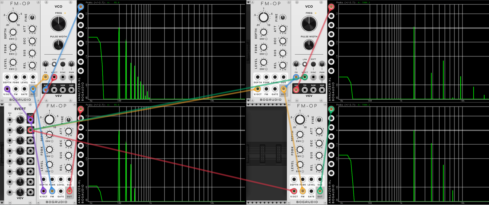

# FM Spectrum changes with frequency

When you transpose a PM patch, the spectrum stays the same, just like it would with an analog VCO or a wavetable. But when you transpose an FM patch up, the harmonics are reduced.

This follows mathematically from the formulas at the start, but let's see it on the analyzer. Just in case the calculus is a little rusty.

But first things first. Neither of these it "right" they are just different. Yes, the PM sound a little more like what we might expect, and will sound a bit brighter as it rises in pitch. Conversely the FM will get quite a bit duller as it raises in pitch. Both are useful.

Here is an image that shows this. The top row is PM, the bottom row is FM. The left column is fundamental = 100Hz, the the second is 2000Hz. In all cases, the sine from an FM-OP is uses as the modulator. A VCV 8 Vert is supplying the pitch CV to all of them.

If you look at the left column, you can see we have set both the PM and FM vco with enough FM to generate a harmonic at 200Hz. that is about 11 Db below the fundamental, and a harmonic at 300Hz. that is about 32 Db below the fundamental.

Then on the right side we have transposed everything up about 4 1/2 octaves. The PM, in the lower right still has that spectrum, with harmonics at -12 Db and -32 Db. But the FM VCO is now much mellower, with harmonics at about -38 Db and -28 Db