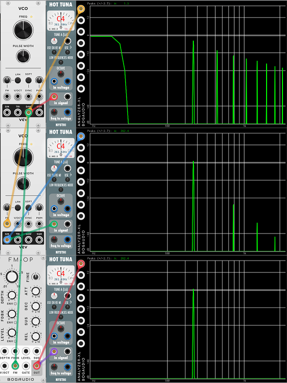
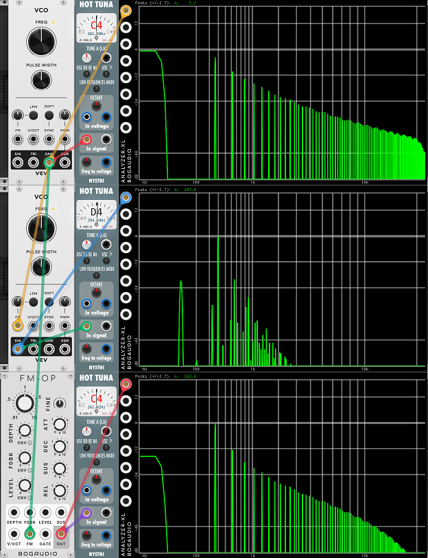
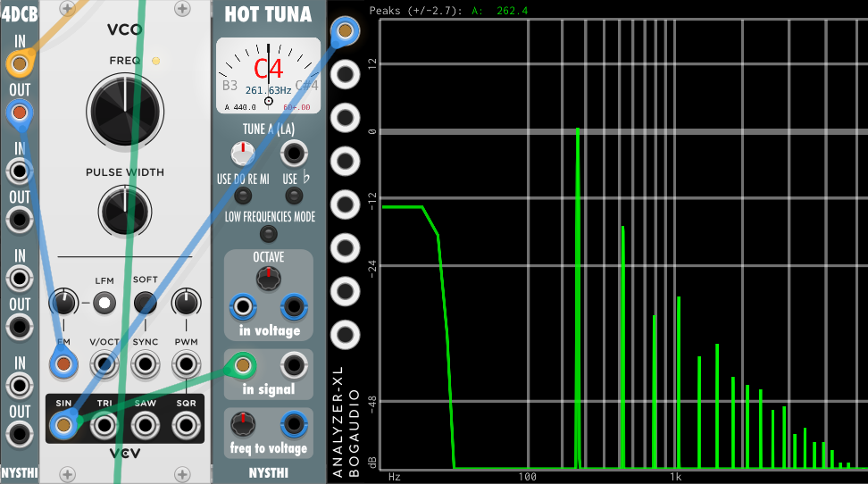

# FM goes out of tune with DC on the modulator

In this patch we have:

* A Fundamental VCO on the first row. This will be our modulator.
* A Fundamental VCO on the second row. This will be our FM VCO.
* A Bogaudio FM-OP on the third row. This will be our PM VCO.

Beside each VCO is a tuner showing the pitch, and a spectrum analyzer showing the VCO spectrum.

This patch has everything at the default, so all three VCOs are at middle C, and the modulation amount to the FM and PM VCOs is zero, so there is no FM or PM.

Looking at the tuners, you can see they are all at C4 like the should be.

There are a couple of things on the spectrum analyzer that may seem strange:

* The sawtooth wave on top is showing a bit of DC on the output. This is normal for Fundamental VCO.
* The middle sine wave has some visible odd harmonics. This is the analog emulation of Fundamental VCO. It puts out a slightly distorted sin, much like a typical analog VCO would.

The DC on the saw output is, in fact, a bug in Fundamental VCO, and is logged here: https://github.com/VCVRack/Fundamental/issues/111. But we have seen before that small amounts of DC on module outputs are very common. See [this paper](./dc.md) for more info.

Anyway, everything is in tune.

Now let's turn up the linear FM/PM to get some harmonics, and see what happens.

You can see that both of the VCOs got more harmonics by virtue of the linear FM/PM that we have applied. But notice also that the FM VCO (middle) is not very far out of tune - a whole semitone. But the PM VCO at the bottom has not changed the fundamental pitch at all, it's still in tune.

You can see also the the shape of the spectra are different, too. The harmonics on the FM VCO fall off much faster then on the PM VCO. This is due to differences between PM and FM, but it's not a very realistic patch. Rarely would one use a sawtooth for a modulator.

As expected, if we add a DC block module at the FM input we can avoid this out of tune. As we said, the shift in pitch is caused by DC on the input. FM is very sensitive to it, and PM is immune to it.

Note that even with the DC block the FM is new completely in tune.

The next page shows how [FM changes spectrum with frequency](./fm-spectrum.md).