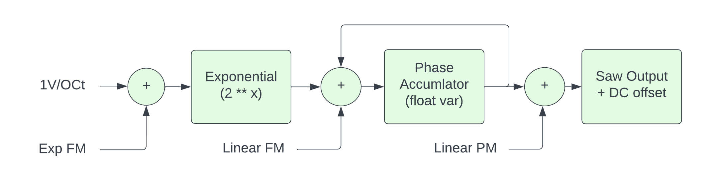

# FM vs PM

Many synthesizers that claim to be "FM" actually use Phase Modulation to generate their timbres. For example the Yamaha-DX7 is a PM synthesizer. The Bogaudio FM-OP and SquinkyLabs Kitchen-Sink are both PM modules. The VCV Fundamental VCO, on the other hand, uses FM.

In this document, when we say "FM" we always mean through zero liner FM. And when we say "PM" we always mean through zero linear phase modulation.

People who know a bit about DSP or physics know that phase and frequency are closely related by simple calculus:

```text
frequency = change in phase with respect to time ( dp / dt)

phase = integral over time of frequency
```

This suggests that FM and PM can sound the same if the modulator signal is properly filtered, which is true. But most often these modulators are not filtered, and hence they can sound very different.

While the math that relates freq and phase is slightly interesting, you can use it to reason about PM vs FM. For example, a triangle wave is the integral of a square wave, so FM with a square wave modulator will sound the same as PM with a triangle wave modulator(!)

There are two things that make PM an attractive choice, rather than FM.

1. With FM, any DC on the modulator input, any at all, will change the tuning of the oscillator.
2. With PM, the ratios of the harmonics stay the same as the oscillator transposes. With FM the high harmonics drop off as the pitch gets higher.

[ people who remember their intro to calculus will realize both of these properties of FM/PM are easily derived from the formulae above that relate frequency and phase ]

## How do you make FM or PM



Warning: all the code, below, is "pseudo code". Some things are left out, it's all super inefficient, it will alias, if doesn't account for some cases etc...

The diagram above is a block diagram for a VCO that has both PM and FM. As you can see, it's quite simple. In the first block, all the exponential FM CVs are added together. Typically this would be the V/Oct input, and the output of an attunverter being fed with an "FM" input. This is then exponentiated to give a linear frequency. In c++ the first two blocks are:

```c++
const float logFreq = volts-per-octave + mod1 + mod2;
float freq = std::pow(2, logFreq);
```

This linear frequency may then be added to linear FM input. Then both feed the phase accumulator. The phase accumulator is just a variable that we keep adding the frequency to, it rolls over so that it stays between 0 and 1:

```c++
freq += linear-fm-input;
phaseAccumulator += freq;
if (phaseAccumulator > 1.f)   
    phaseAccumulator -= 1.f;
```

Then PM is added in to give the final phase

```c++
float phase = phaseAccumulator + linear-pm-input;
```

## Next

The next page shows how [FM can go out of tune](./fm-tune.md).
