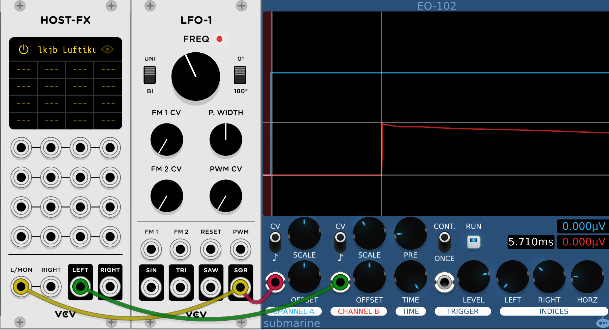
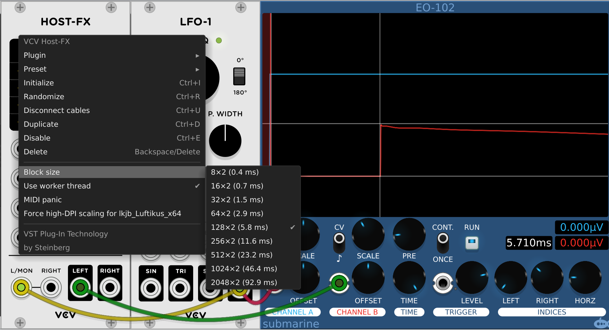
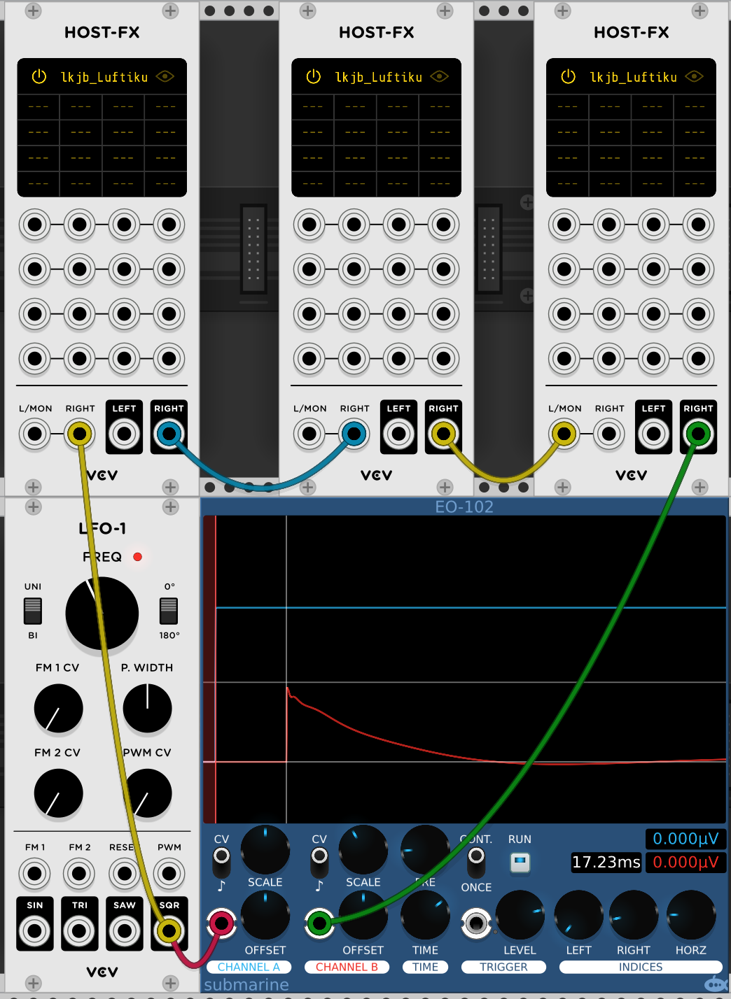
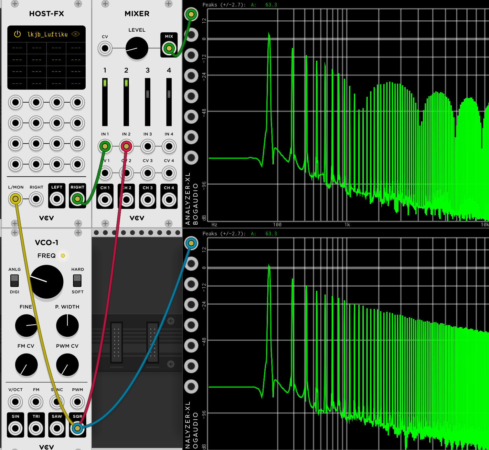

# Host delay

The VCV Host plug-in works super-well to integrate VST into VCV. It's a paid plugin, but most people find it well worth the cost, especially if they already have a bunch of VST.

Sometimes a VCV user has a choice between a "native" VCV module and a VST that does something similar. We believe there are reasons to prefer a native VCV module, when possible:

1. The native VCV solution is probably free.
2. Host + VST will often take up more screen space.
3. Host, by it's nature, will introduce a delay.

The first two are pretty obvious, but the third one, delay, is less obvious, and perhaps not understood as well. So we will write about that.

## Measuring delay

This is a basic setup for measuring delay. Here we are running a low frequency square wave through Host and the session is set to a 44.1 kHz sample rate. Host has loaded a VST EQ that is set to bypass. We are using the Submarine Envelope Scope, since it is really good for measuring the time between different traces.

## Does host delay?

Of course it does. The “block size” menu tells you how much the output will be delayed relative to the input. You can easily measure this to verify it. Here was are using the same setup described above. Host is set for the default 128x2  (5.8 ms) block size. In this image you can see that the measured delay is quite close to what VCV claims.

## Do the delays add up?

Of course they do. Here is the same patch with three Hosts in series. Again the measured value is pretty close to three times the value for an individual host instance:

## Does running host in parallel cause comb filtering?

Of course it does. Mixing un-delayed audio in VCV Rack with the delayed output of Host will cause comb filtering. This is, in fact, exactly how a flanger works. It is well known that mixing delayed and un-delayed signals will cause a series of infinitely deep notch filters going up from the “critical frequency” of the delay. This frequency will get lower and lower as the delay gets longer and longer.

Here you can see a square wave against a square wave added to itself after going though host. In this example the buffer size is set to the smallest possible, 8 x 2.

Doubling the buffer size to 16 causes the notch to move down an octave, as expected.

## When is delay objectionable?

Ah, the answer to that is very complicated! It depends on the nature of the sound, if you running signals in parallel, how closely you are listening, whether comb filtering sounds good or bad on your signal, etc...

Remember: The delay of host depends entirely on the buffer size selected in host. The default is 128 X 2 (5.8 ms. at 44.1), the minimum is 8 X 2 (.4), and the max is 2048 X 2 (92.9 ms).

### Regular VI

If you put a virtual instrument into Host, will the delay matter? Often it won’t matter much. If it’s a string pad with a slow attack, you are unlikely to notice a few tens of milliseconds of delay. So Host running at the default latency will be fine in this application.

If the VI is making a very rhythmic sound, like a piano, and is very “exposed” in the mix then perhaps 10 milliseconds (or even more) is a safe delay before you might notice the timing getting "odd".

If the sound is a drum and you are mixing it with other sounds in VCV that occur at “exactly” the same time, then it might be possible to notice just a few milliseconds of delay causing your to “drums” to “flam” slightly. Whether a one or two milliseconds of delay on a drum is audible if going to depend on a lot of factors – quite often it is totally un noticeable. But delays of 10 milliseconds or more will start to produce obvious flaming.

## Adding a VST effect to a VCV synth voice

This case is really the same as the VI case, as any delay added to your synth voice will not cause any comb filtering or other strange artifacts, and will only be noticeable or objectionably in some cases?

### Effects send on a mixer

If you use host on a mixer effect send, the host delay will basically become a “pre delay” on the effect. So if you are using a reverb it’s probably fine. You either won’t hear it, you will hear it and it will sound better or it will sound slightly worse and you may want to decrease the pre-delay in the reverb itself.

If you are using a rhythmic or slap delay on a send you can probably get it to sound right with a short host buffer setting.

Just remember not to mix effect and non-effect signals - use all send an no direct, if you mixer allows it. For more on this, refer to the section above on comb filtering; and the section below on parallel effects.

### Parallel effects

This one just plain will not work without a lot of effort – except as a special effect. We saw, above, that mixing host and non-host audio in parallel is going to make severe comb filtering that will be audible in many/most situations. Of course if you really want to you can add a matching delay to the other side of the chain and get them in sync again.

And a VST that does parallel processing itself won’t have the problem.

## Bottom line

Host is of course a great addition to VCV, and give access to a ton of great sounds. But a careful user should always keep in mind that Host is going to be adding some delay, and either adjust the path/settings, or use Host is situations where the delay is harmless.

We claimed, above, that for the VI case the delay can be made un-noticeable with small buffer size settings, assuming your computer is up to it. And that this applies to VST effects added to a VCV synth voice. But if you don't pay attention to this and use large buffer settings you could end up with noticeable and objectionable delay that make your instruments sound behind the beat.

We also claimed that in parallel effects cases, or when used on a mixer send in a case where the direct signal is mixed (really the same thing) that extreme comb filtering is unavoidable.

Of course native VCV modules introduce only a single sample of delay.
