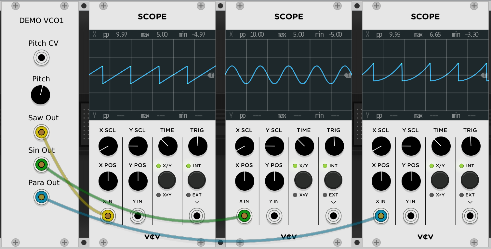
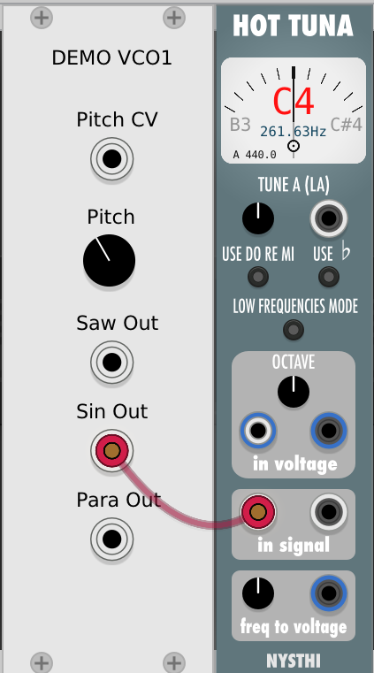
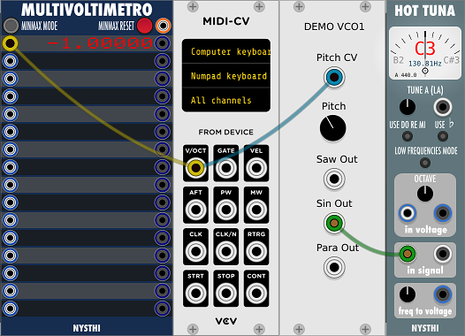

# First test of VCO1

## Examine on scope

Since VCO1 will always generate at least one channel of output, we can look at the output with the VCV Fundamental scope without needing to make a patch. So let's look at the different waveforms. Here VCV's Fundamental scope is uses.

We can see some good thing here. The basic shapes of all the waveforms look correct, with no obvious gaps, jumps, or other strangeness. The output voltage swings between +5 and -5 as desired (except the crazy parabolic. More on that later).

Now let's check out the tuning. First - with no input (zero volts) The VCV spec says we should put out C4. Here we are using NYTHI's Hot Tuna to check the pitch.

Now let's see if it tracks at 1V/Octave like it's supposed to. Here we again use Hot Tuna to check the pitch, VCV's MIDI-CV to generate precise voltages, and NYTSHI's multivoltimetro to display the voltage.

So we see that the pitch changes by an octave when the CV changes by a volt.

So far, it looks like VCO1 is working perfectly. In out next session we will dig a little deeper and find some pretty bad flaws in VCO1.
