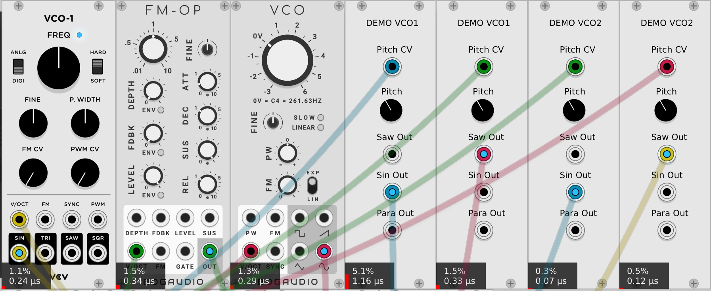
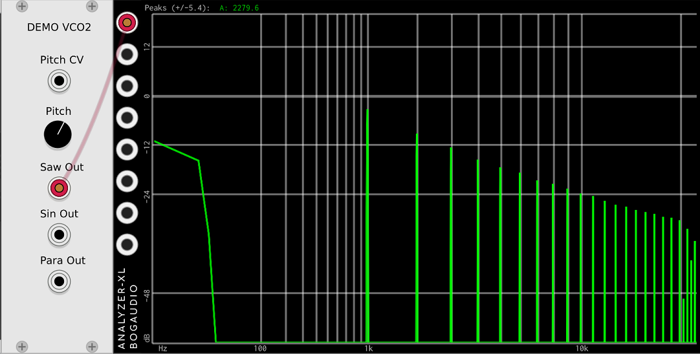

# Introducing Demo VCO2

So far we have seen that Demo VCO1 pretty much works, but has two terrible flaws:

* It uses way too much CPU to generate a sine wave.
* The sawtooth output has way too much aliasing and other "digital nasties".

Along the way we have learned how to measure these things - knowledge that is very useful when evaluating which modules you might want to invest your time in.

There are very common and straightforward ways to fix the flaws with Demo VCO1, and VCV Rack provides the tools to make it easy for a module developer.

First the easy one - the CPU usage. There are two immediate "red flags" in the Demo VCO1 source code, and they are both cases where we called the standard C++ functions. In general you are playing with fire calling any standard functions from your time sensitive code.

You may wonder - "why should that be true"? Why, after all, would today's compilers and runtimes provide bad implementations of these functions, and how can we do better? The answer is, the standard implementations are not bad, they are very, very good. But they have different requirements than VCV Rack:

* They are required by the C++ spec (and common sense) to be extremely precise.
* They are required to accept any valid number as an input.
* Probably some other things I'm not thinking of. :)

With this in mind, it's pretty clear that using the standard C++ function `std::sin()` to shape our sine wave is going to be using up a lot of CPU. If we didn't know that, and merely suspected it, we could just remove that function and run the test again. But here it is obvious, because the only difference between our sawtooth and our sine wave is that one function call.

What are the most important requirements for our sine wave code?

* We will be sending it only numbers between 0 and 1 to represent the phase of the signal, where 1 represents `2 * pi` (approximately 6.28318) in radians.
* It needs to be only accurate enough so that the resulting sine wave is "pure enough".

In this case we don't have to agonize over this, or do our own math, because we can just use code from VCV Fundamental VCO-1.

We can see from the documentation that the function domain is 0…1 like we want, and the sine purity of VCO-1 seems fine.

While we are at it, we can see that where we convert the V/Octave into a linear frequency we use the standard C++ function `std::pow()`. Now, two things about this:

* `std::pow()` is usually not as slow as `std::sin()`.
* As a "pre-optimization" we are already only doing the frequency calculation every four samples.

Nonetheless, the VCV Rack SDK provides a faster function just for this purpose, so we might as well use it.

Our trick of only doing the frequency calculations every fourth sample is a trade off. It saves CPU (a lot in a more realistic module), but it could make it sounds worse. In this case it means that running an audio source into the V/Octave input will sound different. For this VCO, we believe it's a good trade off, but others may disagree.

Later we will talk about alias reduction, but now let's look at the CPU usage.

This time we increased the patch polyphony to 16 channels, to make the CPU usage numbers large enough to see differences between the VCOs.

The first surprising thing - almost shocking - it that Demo VCO2's sine is almost 15 times more efficient now!

Another surprise is that Demo VCO2's sine is at least three times more efficient that the other VCOs. Those other VCOs do a lot of things, but at least it shows that if you want to write a dedicated VCO that just does one thing really well, it's usually possible, and not even particularly difficult.

Lastly, notice that the performance of the sawtooth output is much better now. The only thing we changed that would affect Saw is using the fast approximation `rack::dsp::approxExp2_taylor5()` to replace `std::pow()`. Even with the four times strength reduction we used, it's clear the `std::pow()` can also be a bottleneck.

Now let's address the aliasing. There are, broadly speaking, four well known ways to deal with aliasing, all of them used in some VCV modules:

1. Oversampling
2. minBlep
3. Something else
4. Do nothing

The first two techniques, oversampling and minBlep, are often used by VCV modules.

"Something else" is usually something that will be very specific to the individual module, and probably require a lot of skill and effort. We believe [the Vult modules](https://library.vcvrack.com/?brand=Vult) use "something else".

Oversampling can work with any module, but can be CPU intensive and/or less effective than minBlep. Several [Squinky Labs modules](https://library.vcvrack.com/?brand=Squinky+Labs) use it: [Shaper](https://library.vcvrack.com/squinkylabs-plug1/squinkylabs-shp) (waveshaper), [Stairway](https://library.vcvrack.com/squinkylabs-plug1/squinkylabs-filt) (filter), and [Functional VCO-1](https://library.vcvrack.com/squinkylabs-plug1/squinkylabs-funv).

MinBlep is perfect for our sawtooth. MinBlep is commonly used for digital emulation of "classic analog" waveforms like Saw, Square, Triangle, Hard-synced sine, etc.…

MinBlep stands for "minimum phase band limited step". It makes use of the handy fact that waveforms like sawtooth really only have bad problems when they jump suddenly. minBlep involves calculating what the analog signal "would have been" in only those regions where there is a step. Or something that can be mathematically transformed into a step, like a triangle.

MinBlep:

* Is very effective at reducing aliasing and phase jitter.
* Is quite math intensive.
* Requires at least a mid-level understanding of DSP.
* Cannot be used to reduce aliasing for thru-zero-FM, or other waveforms that don't fit its model.
* Uses almost no CPU at low frequencies, but the CPU load goes up linearly with frequency.

Luckily for plugin developers, the VCV Rack SDK ships with a very good implementation of minBlep, eliminating the need for a masters degree in DSP. It can still be tricky to apply it correctly, but copying code from VCV Fundamental VCO-1 and a bit of trial and error can make it work. For Demo VCO2 we took the minBlep code from VCV Fundamental VCO-1 and modified it very little. In fact we modified Demo VCO2 to be more like VCV Fundamental VCO-1 just to make it easier to steal the minBlep code. (And remember, it isn't stealing, it's legal and encouraged by the open source license. Just make sure you actually read the license and abide by the terms).

So, here is what the aliasing looks like now in Demo VCO2:

Not surprisingly, it looks exactly like VCV Fundamental VCO-1. Which is should, since it's the same code. You will also notice that the DC offset that we previously saw in VCV Fundamental VCO-1 has now crept into our Demo VCO2.

The analyzer also shows that we succeeded in getting rid of the aliasing from our parabolic VCO with the same minBlep. Disappointingly, the analyzer also suggests that it won't sound much different than a straight saw. We included it because:

* You can see that minBlep can be used with almost any waveform that consists of mostly smooth curves and abrupt steps.
* It allowed us to do a "clever" trick to reduce CPU usage. Both the sawtooth and the parabola use the same minBlep, rather than using two, one for each.

MinBlep is a large topic. Of course we can't cover all of it here. Below are links to some of the more commonly sited papers. Being university research they are very heavy on the math and DSP.

* [Alias-Free Digital Synthesis of Classic Analog Waveforms](https://ccrma.stanford.edu/~stilti/papers/blit.pdf) covers a bunch of different techniques.
* [Hard Sync Without Aliasing](http://www.cs.cmu.edu/~eli/papers/icmc01-hardsync.pdf) focuses on minBlep.

Next, [introducing Demo VCO3](./vco3.md)…
