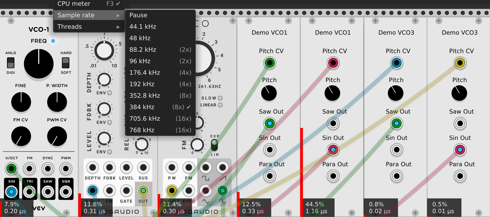
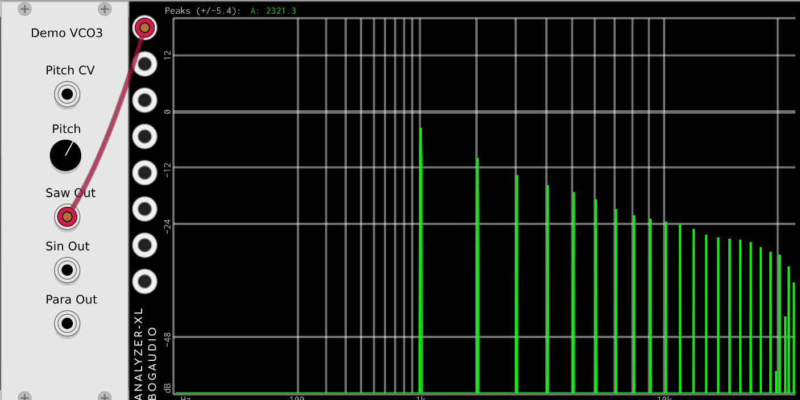

# CPU usage of Demo VCO3

Now that the CPU usage is getting so low, we turned VCV Rack's sample rate up much higher so that we can generate some bigger numbers from the CPU meters. In our experience, these numbers can fluctuate a bit, sometimes reading more CPU, sometimes less, depending on the patch.

But, for sure, we can see that converting our VCO to use SIMD instructions has made it very efficient when using 16 polyphonic channels. And, by tuning the sine approximation, we have gotten the CPU usage of our sine really low:

A few things are clear from the screen shot above:

* Our CPU usage has gone from pretty poor in Demo VCO1 to very good in Demo VCO3.
* Demo VCO3 now seems to be quite a bit more efficient than the "comparable" VCOs we have tested against.

Looking at the display of the frequency analyzer, it's also clear that we did indeed fix the DC on the sawtooth outputs.

